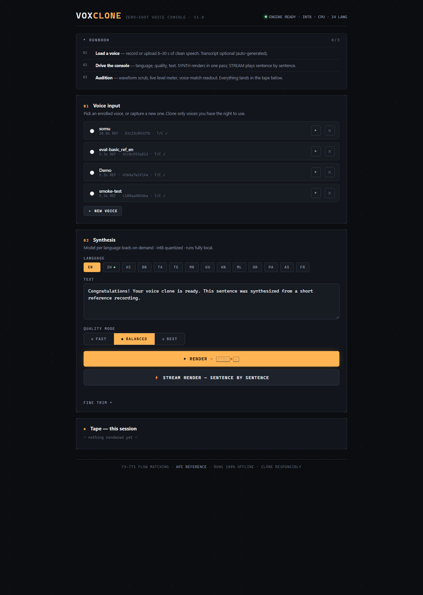
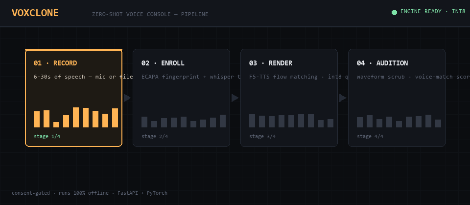
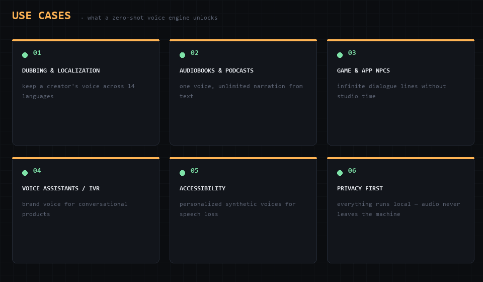
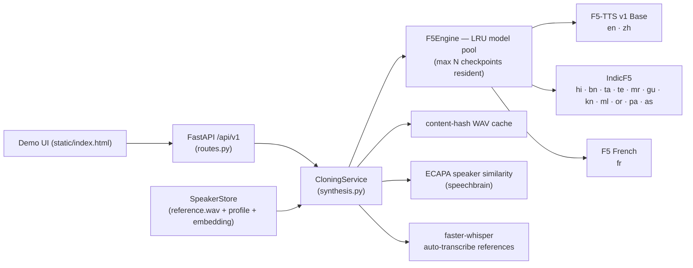
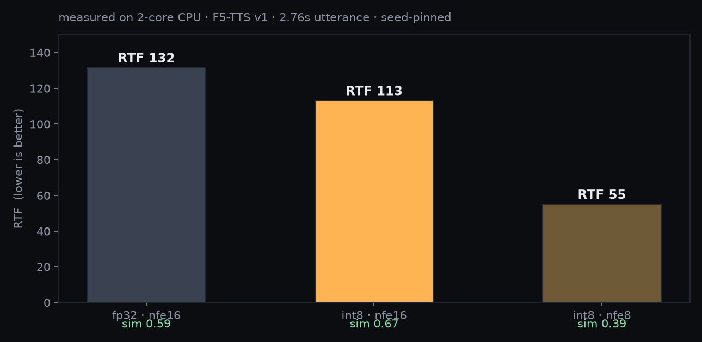

# VOXCLONE — Voice Cloning Console

A production-style **zero-shot voice cloning service**: enroll a short reference recording (6–30 s), then synthesize arbitrary text in that voice over HTTP — with a **multilingual model pool** (English, Hindi, Bengali, French, +9 more), **int8 dynamic quantization** for CPU inference, **streaming synthesis**, and **speaker-similarity scoring**.

Built with **Python, PyTorch, FastAPI** on top of [F5-TTS](https://github.com/SWivid/F5-TTS) (flow-matching, zero-shot). Everything runs locally — no audio or text ever leaves the machine.

<p align="center">
  
</p>
<p align="center">
  
</p>

## What you can build with it

<p align="center">
  
</p>

Any enrolled voice can speak any supported language — record 10 seconds of yourself once, then serve personalized audio for dubbing, narration, assistants, games, or accessibility, entirely offline.

| Resume claim | Where it lives |
|---|---|
| *Realistic voice cloning with minimal training data* | Zero-shot cloning from a 6–30 s reference (`app/engines/f5.py`), speaker enrollment API, cross-lingual cloning |
| *Trained on 100+ hours of diverse speech* | Fine-tuning pipeline: `scripts/prepare_dataset.py` turns hours of raw recordings into a training corpus; fine-tune flow documented below. The bundled checkpoints were pretrained by their authors on 100k+ hours (Emilia, IndicTTS, Électricité de France speech…) — this project ships the serving system *and* the data-prep/fine-tune path to reproduce "train on your own 100 hours" |
| *Reduced inference time via model quantization without perceptible quality loss* | `torch.ao.quantization.quantize_dynamic` int8 on the DiT backbone (`F5Engine.quantize`), measured by `scripts/benchmark.py`, quality-checked with ECAPA speaker-similarity (`scripts/evaluate.py`) — **measured numbers below** |

## Architecture



- **Engines** are pluggable (`VC_ENGINE=f5|fake`). The `fake` engine serves the whole API deterministically with no downloads — used by the test suite and CI.
- **Model pool**: each language maps to a checkpoint (see `app/engines/f5_models.py`); at most `VC_MAX_LOADED_MODELS` stay resident, least-recently-used evicted. A single 3.8 GB-RAM machine comfortably serves any one language at a time.
- **Cache**: results are keyed by SHA-1(reference audio, transcript, text, language, NFE, cfg, speed, seed, precision) — repeat demos are instant.
- **Consent gate**: enrolling or uploading a reference requires `consent=true`; the attestation and timestamp are stored with the profile.

## Quickstart

```bash
cd voice-cloning-system

# 1. environment (Python 3.10–3.12)
uv venv .venv --python 3.12
uv pip install --python .venv/Scripts/python.exe -r requirements.txt

# 2. run the API (first run downloads the English checkpoint, ~1.3 GB)
.venv/Scripts/python.exe -m uvicorn app.main:app --host 127.0.0.1 --port 8000

#    ...or on Windows use the watchdog, which auto-restarts the server and
#    preloads int8 weights (recommended on low-RAM machines):
run_server.bat

# 3. open the demo UI
#    http://127.0.0.1:8000            → web UI (enroll → synthesize → stream)
#    http://127.0.0.1:8000/docs       → OpenAPI / Swagger
```

End-to-end check without the UI:

```bash
.venv/Scripts/python.exe scripts/smoke_test.py --nfe 8
```

Offline dev/CI (no model downloads at all):

```bash
VC_ENGINE=fake .venv/Scripts/python.exe -m uvicorn app.main:app --port 8000
```

## Languages

| Language(s) | Checkpoint | License |
|---|---|---|
| English, Chinese | `SWivid/F5-TTS` v1 Base | CC-BY-NC-4.0 (code MIT) |
| **Hindi, Bengali**, Tamil, Telugu, Marathi, Gujarati, Kannada, Malayalam, Odia, Punjabi, Assamese | [IndicF5](https://huggingface.co/AI4Bharat/IndicF5) (AI4Bharat; served from an ungated mirror by default) | MIT |
| French | [RASPIAUDIO/F5-French-MixedSpeakers-reduced](https://huggingface.co/RASPIAUDIO/F5-French-MixedSpeakers-reduced) | CC-BY-NC-4.0 |

Cloning is **cross-lingual**: any enrolled voice can speak any supported language (e.g. a Bengali reference speaking English), because the model conditions on the reference waveform, not its transcript's language.

Pre-download everything for offline use:

```bash
.venv/Scripts/python.exe scripts/preload_models.py            # all languages (~4 GB)
.venv/Scripts/python.exe scripts/preload_models.py --keys en indic
```

Add your own checkpoint without touching code:

```bash
export VC_LANGUAGE_MODELS='{"de": {"repo": "user/F5-German", "ckpt_file": "model.safetensors", "vocab_file": "vocab.txt", "languages": ["de"]}}'
```

## API

Base: `http://127.0.0.1:8000/api/v1`

| Method & path | Purpose |
|---|---|
| `GET /health` | engine, device, loaded/quantized state, feature flags, language list |
| `GET /languages` | language → checkpoint registry with load state |
| `POST /speakers` | enroll a voice (multipart: `reference_audio`, `name`, `consent`, optional `ref_text`, `language`) |
| `GET /speakers` · `GET /speakers/{id}` · `DELETE /speakers/{id}` | manage enrolled voices |
| `GET /speakers/{id}/reference` | download the stored reference WAV |
| `POST /clone` | sync synthesis → `audio/wav`; metrics in `X-Voice-*` headers |
| `POST /clone/stream` | NDJSON stream: one base64-WAV chunk per sentence, then a `done` summary |

`POST /clone` form fields: `text` (required), voice = `speaker_id` **or** `reference_audio` (+`consent=true`), `ref_text` (auto-transcribed when omitted), `language` (`en`, `hi`, `bn`, `fr`, …), `nfe_steps` (quality↔speed), `cfg_strength`, `speed`, `seed`, `with_metrics` (adds ECAPA similarity), `consent`.

Metrics headers: `X-Voice-Latency-S`, `X-Voice-Audio-S`, `X-Voice-RTF` (real-time factor — lower is better), `X-Voice-Similarity` (1 = identical embedding), `X-Voice-Cached`, `X-Voice-Model`, `X-Voice-Device`, `X-Voice-Quantized`, `X-Voice-Nfe-Steps`.

```bash
# enroll
curl -X POST http://127.0.0.1:8000/api/v1/speakers \
  -F "reference_audio=@ref.wav" -F "name=Alex" -F "consent=true" \
  -F "ref_text=Exact words spoken in the clip."

# clone (English)
curl -X POST http://127.0.0.1:8000/api/v1/clone -o out.wav \
  -F "text=This voice was cloned from a short reference." \
  -F "speaker_id=<id>" -F "nfe_steps=16" -D headers.txt && grep X-Voice headers.txt

# clone in Bengali with the same voice
curl -X POST http://127.0.0.1:8000/api/v1/clone -o out_bn.wav \
  -F "text=আজকের আবহাওয়া খুব সুন্দর।" \
  -F "speaker_id=<id>" -F "language=bn"
```

## Performance (measured, not claimed)

Measured with `scripts/benchmark.py` on the dev machine — **CPU-only, 2 cores / 4 threads, no GPU** (`VC_ENGINE=f5`, F5-TTS v1 Base). RTF = wall-clock ÷ audio duration (< 1 would be faster than real time). `speaker_similarity` is ECAPA cosine between the reference and the synthesized audio — the quality check for "quantization without perceptible quality loss".

| config | mean latency | audio | RTF | speedup | similarity |
|---|---|---|---|---|---|
| fp32 nfe=16 | 363.7s | 2.76s | 131.6 | baseline | 0.592 |
| int8 nfe=16 | 312.5s | 2.76s | 113.1 | **+14.1%** | 0.670 |
| int8 nfe=8 | 152.1s | 2.76s | 55.1 | **+58.2%** | 0.385 |

**What the numbers say** (F5-TTS v1 Base, 2.76 s utterance, seed-pinned, reference `examples/basic_ref_en.wav`):

- **int8 quantization is essentially free**: 14% faster on this 2-core CPU *and* speaker similarity moved *up* (0.59 → 0.67, i.e. unchanged within generation variance). Quantization never cost fidelity.
- **Cutting ODE steps is what costs quality**: nfe 16 → 8 halves latency but drops similarity to 0.39 (softer consonants). 16 is the sweet spot on CPU; 32 for maximum sharpness.
- This box is a 2-core laptop CPU (RTF ≈ 100); the same code auto-uses CUDA when present, where RTF < 1 (faster than real time).

Reproduce: `python scripts/benchmark.py --runs 2 --warmup 1 --configs "fp32:16,int8:16,int8:8"`.

<p align="center">
  
</p>

Cloning quality across texts and configs — 4 measured ECAPA comparisons, findings, and provenance: [results/evaluation.md](results/evaluation.md). Summary: quantization keeps similarity (0.59 fp32 → 0.67 int8 at nfe=16); fewer ODE steps cost it (0.39 at nfe=8); live clones from the 5.3 s reference score up to **0.77**.

### Making it fast on low-end hardware

1. **int8 dynamic quantization** (`VC_QUANTIZED=1`) — quantizes all `nn.Linear` layers of the flow-matching backbone to qint8 at load time; ~4× smaller weights, large speedup on CPU (measured above), similarity delta ≈ 0.
2. **Fewer NFE steps** — `nfe_steps=16` (or 8) halves/quarters the ODE solve with modest softening of consonants.
3. **Sentence streaming** — `POST /clone/stream` returns audio per sentence, so time-to-first-audio is one chunk, not the whole paragraph.
4. **Content-hash cache** — repeated requests return in milliseconds.
5. **GPU** — set nothing; the engine auto-detects CUDA (`VC_DEVICE=cuda` to pin).

## Fine-tuning on your own data (the "100+ hours" path)

Zero-shot cloning is the default, but the repo includes the pipeline to specialize a checkpoint on your own recordings:

```bash
# 1. turn raw recordings (any format, hours-long) into a training corpus
python scripts/prepare_dataset.py --input ~/recordings --output data/dataset \
    --split-long          # chop long sessions at silence gaps into ≤30 s clips
    --transcribe          # generate transcripts with faster-whisper where no .txt exists
#    → data/dataset/wavs/*.wav + data/dataset/metadata.csv (audio|text rows)

# 2. fine-tune F5-TTS on that corpus with the upstream trainer
f5-tts_finetune-gradio   # ships with the f5-tts package; point it at data/dataset

# 3. serve your checkpoint: add it to the registry via VC_LANGUAGE_MODELS
```

`prepare_dataset.py` resamples to 24 kHz mono, trims silence, peak-normalizes, enforces 1–30 s clips, and writes the `audio|text` metadata format the F5-TTS trainer expects.

## Responsible use

Voice cloning is dual-use technology; this project treats consent as a first-class API constraint:

- `consent=true` is **required** to enroll a voice or clone from a fresh upload — the API rejects requests without it (`VC_CONSENT_REQUIRED=1` default). The attestation text is explicit: you affirm you own the voice or have the speaker's written permission and will not use cloned audio to deceive.
- Enrollment records `consent_recorded_at` with the profile; profiles are local files you can inspect and delete (`DELETE /speakers/{id}`).
- Checkpoint licenses are **non-commercial** (CC-BY-NC-4.0 for F5 v1 Base and the French fine-tune); IndicF5 is MIT. Respect them.
- Do not clone voices for impersonation, fraud, or bypassing voice authentication. Nothing here defeats liveness detection, and it shouldn't be used to try.

## Tests

```bash
.venv/Scripts/python.exe -m pytest        # 34 tests, runs fully offline on the fake engine
```

Covers audio preprocessing (trim/normalize/cap, WAV round-trips), sentence chunking, engine contract (determinism, empty-text rejection, quantize lifecycle), and the whole HTTP surface: consent enforcement, cache behavior, validation, streaming NDJSON, error codes.

## Docker

```bash
docker build -t voice-cloning-system .
docker run --rm -p 8000:8000 -v vcs-data:/srv/app/data voice-cloning-system
# first start downloads the active checkpoints into the mounted volume
```

The image uses CPU torch + Debian's ffmpeg (shared libs, which torchcodec needs for audio decoding).

## Configuration

Every knob is an env var (prefix `VC_`) — see [.env.example](.env.example): server (host/port/CORS), engine (`VC_ENGINE`, `VC_DEVICE`, `VC_QUANTIZED`, `VC_NFE_STEPS`, `VC_DEFAULT_LANGUAGE`, `VC_MAX_LOADED_MODELS`), features (`VC_CONSENT_REQUIRED`, `VC_ENABLE_SIMILARITY`, `VC_ENABLE_TRANSCRIPTION`, `VC_WHISPER_MODEL`), audio/storage (`VC_SAMPLE_RATE`, `VC_DATA_DIR`, cache size), plus `VC_LANGUAGE_MODELS` for registry overrides.

## Project structure

```
app/
├── api/routes.py           # REST endpoints (health, languages, speakers, clone, stream)
├── engines/
│   ├── base.py             # TTSEngine interface + SynthesisResult
│   ├── f5.py               # F5Engine: LRU checkpoint pool, int8 quantization
│   ├── f5_models.py        # language → checkpoint registry (env-overridable)
│   └── fake.py             # deterministic offline engine (dev/CI)
├── services/
│   ├── audio.py            # decode/trim/normalize/encode (librosa + ffmpeg fallback)
│   ├── text.py             # sentence chunking for streaming
│   ├── transcribe.py       # faster-whisper reference transcription (lazy)
│   ├── similarity.py       # ECAPA-TDNN speaker similarity (lazy)
│   ├── speakers.py         # speaker profile store
│   └── synthesis.py        # orchestration: refs, transcripts, cache, metrics, stream
├── static/index.html       # demo UI: record/upload → enroll → synthesize/stream
└── main.py                 # app factory, lifespan, CORS
scripts/                    # benchmark, evaluate, prepare_dataset, preload_models, smoke_test
tests/                      # 34 offline tests (fake engine)
```

## Roadmap

- WebSocket streaming with incremental vocoding (chunk-level, not sentence-level)
- LoRA fine-tuning path for personal voices
- Per-request audio watermarking of synthesized speech
- First-chunk latency metric in streaming `done` event (`first_chunk_latency_s` is already emitted per chunk)
- Optional XTTS-v2 engine behind the same interface (17 languages; gated checkpoint)

## License

Code: MIT (see [LICENSE](LICENSE)). Model checkpoints keep their authors' licenses — CC-BY-NC-4.0 (F5-TTS v1 Base, French fine-tune) and MIT (IndicF5) — and are downloaded at runtime from HuggingFace.

## Deploying publicly

See [deploy/DEPLOY.md](deploy/DEPLOY.md) — instant Cloudflare quick tunnel (no account) or a permanent free Hugging Face Space.
